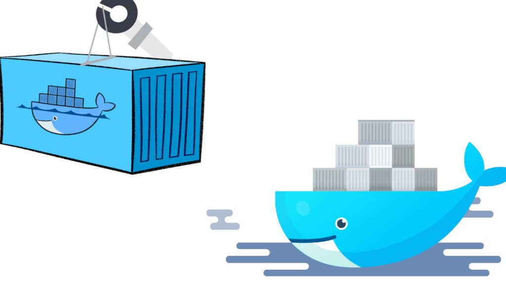

# Inception

This project is the 15th of the 42 School cursus. 

# Description
In this project, we must setup multiple docker containers, and deploy a simple default website using Mariadb, WordPress, and NGINX. 
The containers must be part of a docker network, and must be accessible only through the NGINX container, via port 443 (https). 
Also, we must be able to connect to our website using URL `<login>.42.fr` 
 
Because of the website data must be persistent, the use of docker volumes is expected. 
In case of crash, services must restart automatically. 
